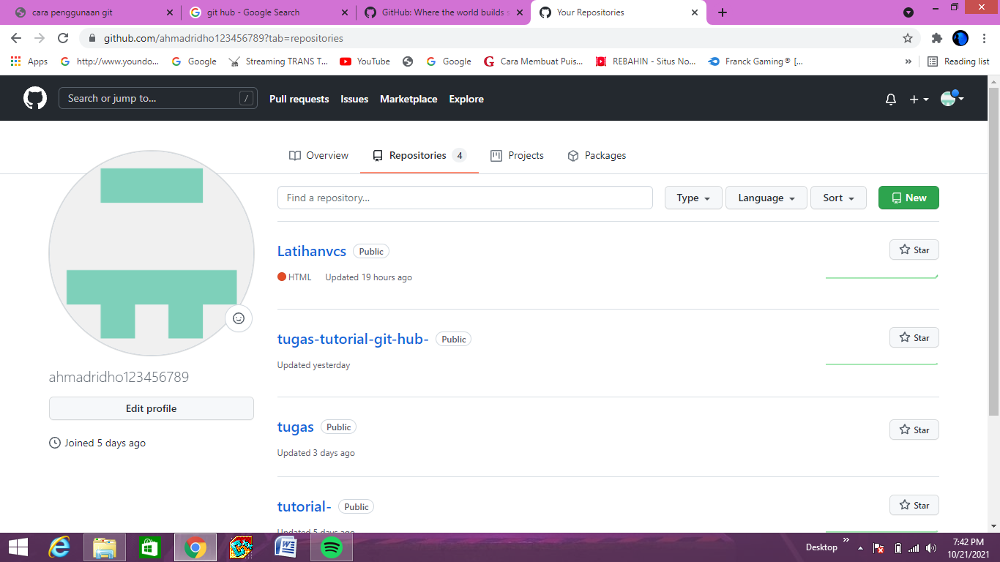
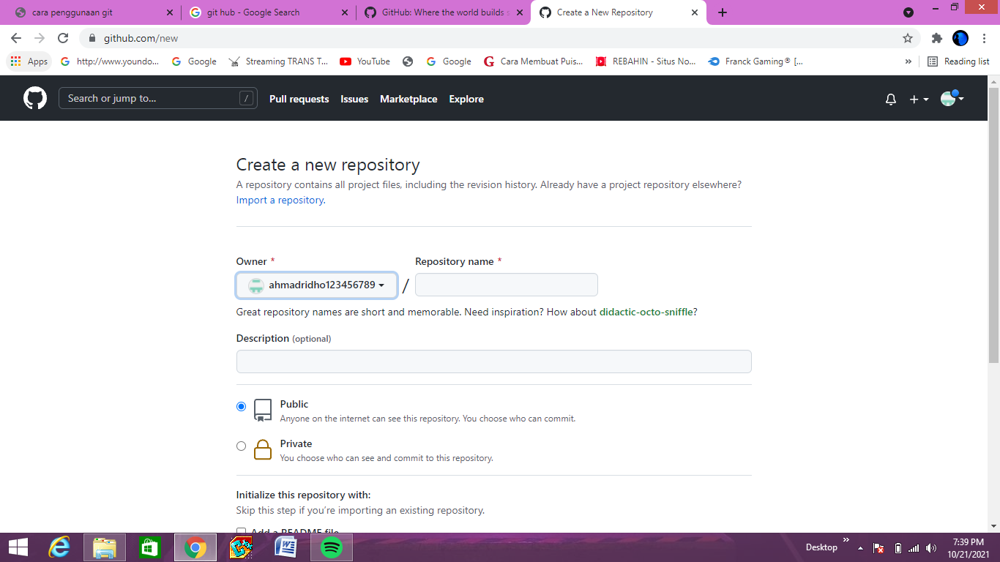

# Latihanvcs
## tutorial menggunakan git oleh ridho

Langkah pertama kilk github, setelah itu buatlah akun Anda. Setelah selesai, langsung masuk ke halaman utama dan klik tombol “+” untuk membuat repositori baru. berikut contoh gambar-nya:

 Langkah pertama kilk github, setelah itu buatlah akun Anda. Setelah selesai, langsung masuk ke halaman utama dan klik tombol “+” untuk membuat repositori baru. berikut contoh gambar-nya:

 Sebelum melakukan pengungguhan,pastikan bahwa project yang akan diunggah sudah tersedia git. Setelah itu, bukalah folder project dengan file eksplorer kemudian klik kanan “open terminal/cmder here”
Dalam melakukan pengunggahan, ada beberapa perintah dasar yang digunakan, yaitu : git init, git add, git commit -m, git remote add origin, git push -u origin master. berikut contoh gambar-nya:

###### apabila kurang jelas liat you tube 

