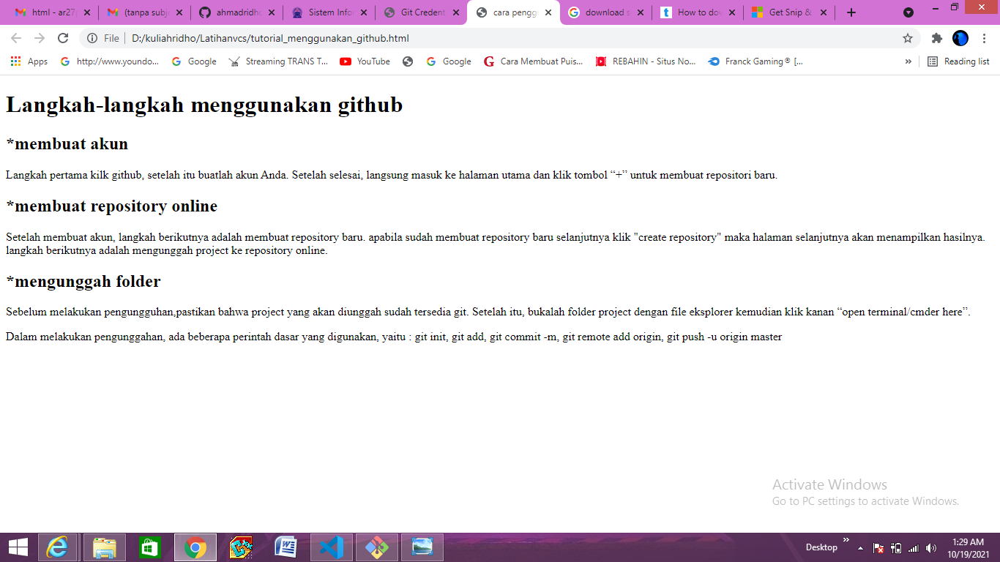

# Latihanvcs
## tutorial menggunakan git oleh ridho

Langkah pertama kilk github, setelah itu buatlah akun Anda. Setelah selesai, langsung masuk ke halaman utama dan klik tombol “+” untuk membuat repositori baru. berikut contoh gambar-nya:

